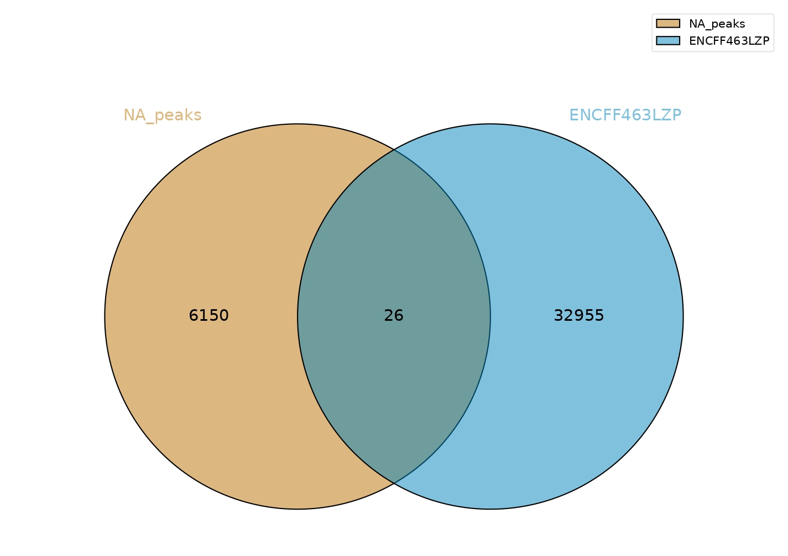
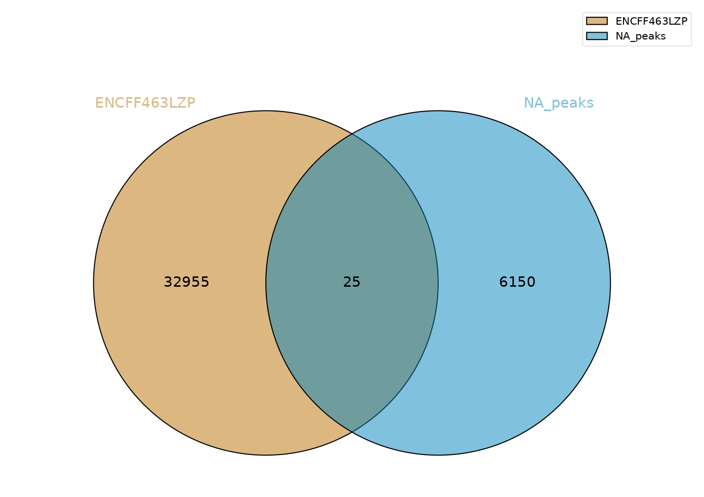

# hse_hw2_chip

# hse_hw2_chip

[Google Colab](https://colab.research.google.com/drive/1Hyc12B3m_ah6MgNQJjOI8N5n2kExVRhz?usp=sharing)

Клеточная линия -- DDOH2

Гистоновая метка -- H4K20me1

# Анализ FastQC

Качество ридов оказалось в целом, приемлимым.

Все, кроме CG-conteny оказалось хорошим:

Проблемы возникли только CG-distribution:

Подрезание не сильно помогло, поэтому я его дальше не использовал:

# Таблица выравнивания чтений на хромосому

|Названия|Число чтений|Уникальное выравнивание|Не уникальное выравнивание|Не выравнено|
|---|---|---|---|---|
| ENCFF002BAY | 29828282 | 1193099 (4.00%) | 3633805 (12.18%) | 25001378 (83.82%) |
| ENCFF002AVP | 24145332 | 1024497 (4.24%) | 3235833 (13.40%) | 19885002 (82.36%) |
| ENCFF002AYR | 34229117 | 1510676 (4.41%) | 4575912 (13.37%) | 28142529 (82.22%) |

**Ответ на вопрос из колаба**: Не смотря на хорошее качество чтений, процент уникально картированных чтений получился относительно невысоким, хотя и укладывался в рамки нормы. Подрезание чтений, как можно видеть, практически не помогает, поэтому можно использовать в дальнейшем и неподрезанные чтения (что было в целом ясно и по отчетам fastqc)

# Venn Diagrams
## Пересечение наших пиков с Encode

## Пересечение Encode-пиков с нашими

Проанализируйте полученные результаты и приведите свои рассуждения в README.md. Как можно объяснить различия в количестве пересечений?

**Ответ на вопрос (взят из коллаба)**: количество пересечений не очень большое (я бы сказал, что даже маленькое. Различия не существенные в абсолютных цифрах, а в относительных - целых 4 процента. Связано с тем, что некторые пики, из первого файла, попавшие на пики из второго, могли оказаться действителньо меньше (а не такого же размера), и поэтому в себе пики не содержат. Также, как можно видеть, наших пиков существенно меньше, потому что мы исследовали одну хромосомму, а в файле представлена информация для всего человеческого генома.